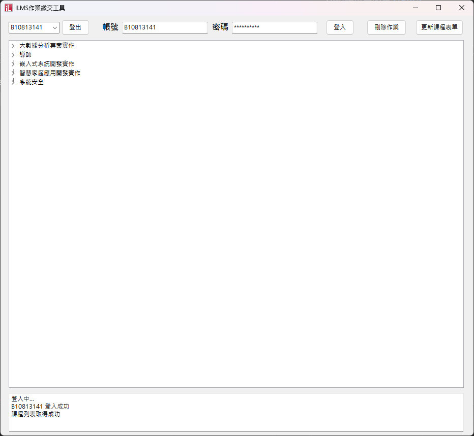
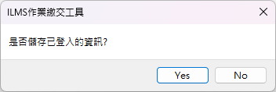

# ILMS 作業繳交工具

### [Youtube演示影片](https://www.youtube.com/watch?v=JM-HAe1ne9k&ab_channel=%E7%84%A1%E7%95%8C)

## 本專案大多使用原生的庫 只有UI設計及網頁資料分析使用外部庫
### UI設計採用的是 [GoVCL](https://github.com/ying32/govcl)
### 網頁資料分析採用的是 [GoQuery](https://github.com/ying32/govcl)
#
## 介紹 
### 此工具支援高併發讀取網頁內容以及上傳檔案
### 若想修改併發數可以在 settings.json 修改 maxConnect
### 支援多人同時繳交作業(特殊用途)

### 支援存儲登入紀錄 及 切換帳號的功能 若不想使用此功能可以再關閉應用時選擇不儲存資料
### 若是已經儲存了可以在檔案目錄下刪除 userinfo 即可

